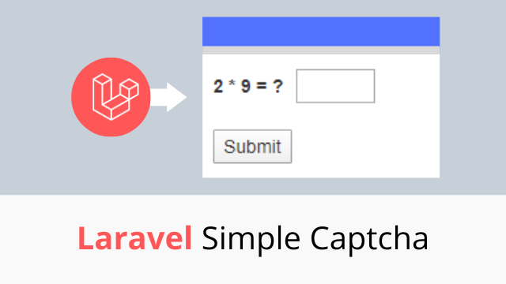

<h1 align="center">Laravel Simple Captcha</h1>

    
    
     
    
    

A simple laravel captcha package

## Features
- Lightweight
- Simple & easy to use
- Support Laravel 5, 6
- Captcha validation rules
- Customizable

## Documentation
Get full documentation of [Laravel Simple Captcha](https://laravelarticle.com/laravel-simple-captcha)
